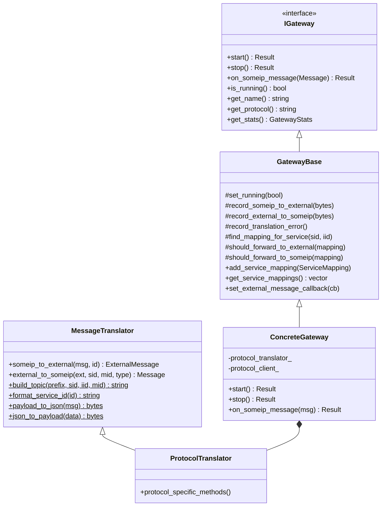
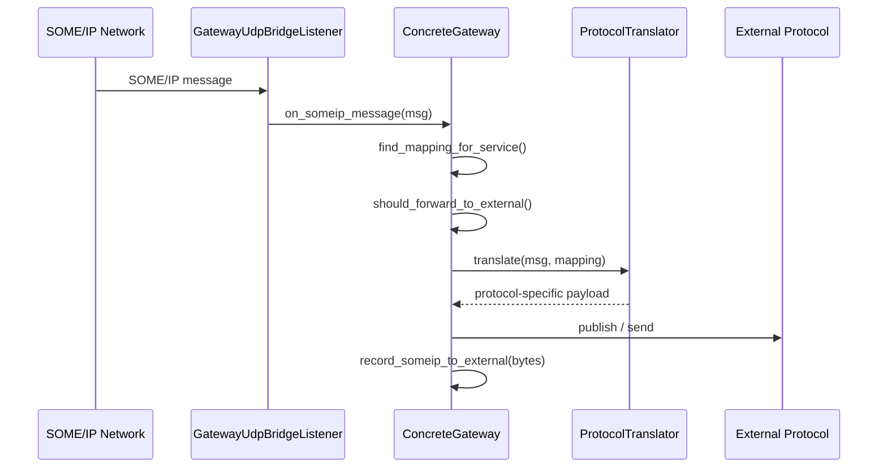
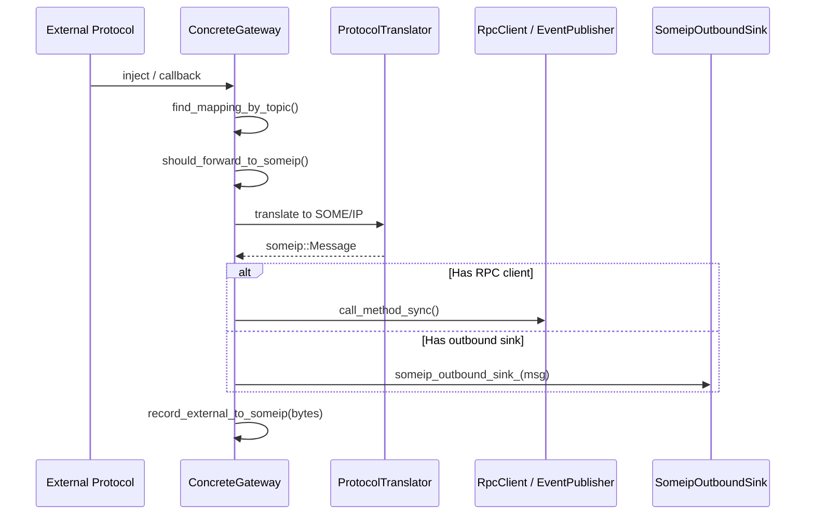
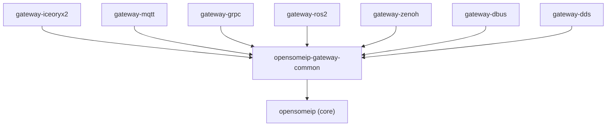

# Gateway Architecture

All opensomeip gateways follow a consistent architectural pattern that promotes code reuse, testability, and clean separation of concerns.

## Class Hierarchy



## Data Flow

### SOME/IP → External Protocol



### External Protocol → SOME/IP



## Service Mapping

The `ServiceMapping` struct is the declarative routing table for every gateway:

```cpp
struct ServiceMapping {
    uint16_t someip_service_id;
    uint16_t someip_instance_id;
    std::vector<uint16_t> someip_method_ids;
    std::vector<uint16_t> someip_event_group_ids;
    std::string external_identifier;     // Protocol-specific name/topic/key
    GatewayDirection direction;          // SOMEIP_TO_EXTERNAL, EXTERNAL_TO_SOMEIP, BIDIRECTIONAL
    TranslationMode mode;               // OPAQUE (raw bytes) or TYPED (JSON envelope)
};
```

A typical YAML configuration:

```yaml
service_mappings:
  - someip_service_id: 0x1234
    someip_instance_id: 0x0001
    someip_method_ids: [0x0001, 0x0002]
    someip_event_group_ids: [0x0001]
    external_identifier: "vehicle/speed"
    direction: bidirectional
    translation_mode: opaque
```

## Thread Safety

| Component | Strategy |
|-----------|----------|
| `GatewayStats` counters | `std::atomic` — lock-free increment |
| Service mappings | `std::mutex` — copy-on-read via `get_service_mappings()` |
| Running state | `std::atomic<bool>` with acquire/release ordering |
| External callbacks | `std::mutex` — guards callback assignment and invocation |
| Protocol-specific state | Pimpl pattern isolates per-protocol resources |

## Design Patterns

| Pattern | Where | Why |
|---------|-------|-----|
| **Template Method** | `GatewayBase` → concrete gateways | Common lifecycle, specific protocol hooks |
| **Strategy** | `MessageTranslator` hierarchy | Protocol-specific payload transformation |
| **Observer** | `ExternalMessageCallback`, `SomeipOutboundSink` | Decouple message delivery from handling |
| **Pimpl** | ROS 2, D-Bus, DDS gateways | Hide heavyweight SDK headers from public API |
| **Bridge** | `GatewayUdpBridgeListener` | Adapt `ITransportListener` to `IGateway` |
| **RAII** | `unique_ptr` for all owned resources | Automatic cleanup on stop/destroy |

## Build System

Each gateway is an independent CMake target:

```text
opensomeip-gateways/
├── CMakeLists.txt              # Root: options, GTest, subdirectories
├── common/                     # opensomeip-gateway-common library
├── gateway-iceoryx2/           # opensomeip-gateway-iceoryx2
├── gateway-mqtt/               # opensomeip-gateway-mqtt
├── gateway-grpc/               # opensomeip-gateway-grpc
├── gateway-ros2/               # opensomeip-gateway-ros2
├── gateway-zenoh/              # opensomeip-gateway-zenoh
├── gateway-dbus/               # opensomeip-gateway-dbus
└── gateway-dds/                # opensomeip-gateway-dds
```

Dependency graph:


