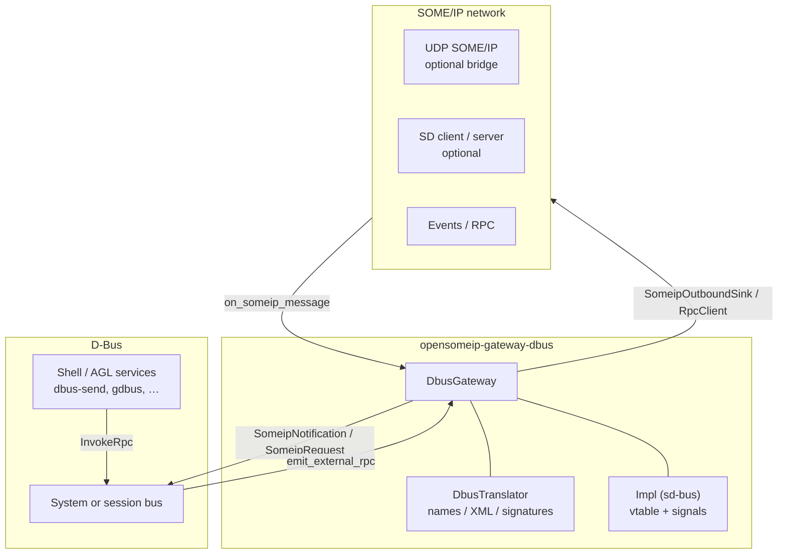

# SOME/IP ↔ D-Bus Gateway

The **SOME/IP ↔ D-Bus** gateway exposes selected SOME/IP services on the **D-Bus** session or system bus so Linux automotive and desktop stacks can observe and drive vehicle-oriented APIs with the same tools used for system services (AGL, GENIVI-era patterns, and general freedesktop-style integration).

!!! info "Source repository"
    Implementation, tests, and examples live in [opensomeip-gateways](https://github.com/vtz/opensomeip-gateways) under `gateway-dbus/`.

## Architecture



At build time, **libsystemd** (pkg-config `libsystemd`) enables the real **sd-bus** backend inside `DbusGateway::Impl`. Without it, the library still compiles and tests can run, but D-Bus I/O is effectively a no-op at runtime until rebuilt with systemd (useful for CI and non-Linux hosts).

## Features

| Area | Behavior |
|------|----------|
| **Signals** | SOME/IP `NOTIFICATION`, `TP_NOTIFICATION`, and eligible `REQUEST` traffic become D-Bus signals **`SomeipNotification`** or **`SomeipRequest`** with signature **`(qay)`** (method/event id + opaque payload). |
| **Method calls** | D-Bus **`InvokeRpc`** (`qay` in, `ay` out) forwards to SOME/IP-style RPC via `emit_external_rpc` and optional `RpcClient` / outbound sink. |
| **Introspection XML** | `DbusTranslator::generate_introspection_xml` emits D-Bus introspection for tooling and documentation when `enable_introspection` is used. |
| **Type mapping** | `someip_type_to_dbus_signature` maps logical SOME/IP type names to D-Bus type strings for XML comments and future typed layouts; the on-the-wire D-Bus payload for methods/signals remains **`ay`** unless you add custom marshalling. |
| **Naming conventions** | Well-known bus names, object paths, and interface names are derived from configurable prefixes and SOME/IP service/instance ids (see below). |
| **System / session bus** | `DbusBusType::SYSTEM` or `SESSION` selects which bus to attach to. |
| **Optional attachments** | UDP bridge into `on_someip_message`, SD client/server hooks, event publisher registry, and event-group subscription match other gateways. |

## D-Bus interface design

Placeholders **`{prefix}`** are your configured `bus_name_prefix` or `object_path_prefix` (normalized: no trailing `.` on bus prefix, leading `/` on path prefix). Service and instance ids use **four-digit lowercase hex** without a `0x` prefix.

| Element | Pattern | Example (`sid=0x4500`, `iid=0x0001`, prefix `com.opensomeip.vehicle` / `/com/opensomeip/vehicle`) |
|---------|---------|-----------------------------------------------------------------------------------------------------|
| **Bus name** | `{prefix}.svc.{sid}.inst.{iid}` | `com.opensomeip.vehicle.svc.4500.inst.0001` |
| **Object path** | `{prefix}/svc_{sid}/inst_{iid}` | `/com/opensomeip/vehicle/svc_4500/inst_0001` |
| **Interface** | `com.opensomeip.Service.{sid}` | `com.opensomeip.Service.4500` |

Methods and signals on that interface (as generated today):

- **`InvokeRpc`**: in `q` method_id, `ay` payload; out `ay` return_payload.
- **`SomeipNotification`**, **`SomeipRequest`**: `q` id, `ay` payload.

!!! note "Interface namespace"
    The **`com.opensomeip.Service.{sid}`** interface name is fixed in code (`DbusTranslator::build_interface_name`); only bus name and object path incorporate your configurable prefix.

## Type mapping (SOME/IP names to D-Bus signatures)

Used for documentation comments and `build_signature_from_someip_types`. Unknown types fall back to **`ay`**.

| SOME/IP type name (accepted aliases) | D-Bus signature |
|--------------------------------------|-----------------|
| `bool`, `boolean` | `b` |
| `uint8`, `u8` | `y` |
| `uint16`, `u16` | `q` |
| `uint32`, `u32` | `u` |
| `uint64`, `u64` | `t` |
| `int16`, `i16` | `n` |
| `int32`, `i32` | `i` |
| `int64`, `i64` | `x` |
| `float`, `float32` | `d` |
| `double`, `float64` | `d` |
| `string`, `utf8` | `s` |
| (any other name) | `ay` |

!!! tip "Wire format"
    Even when introspection comments describe typed layouts, the gateway’s D-Bus API uses **`ay`** for payloads on the wire unless you extend it with your own encoding.

## OpenSOME/IP APIs used

| API | Header | Role in this gateway |
|-----|--------|----------------------|
| [Message](../api/index.md) | `someip/message.h` | Core SOME/IP message type at the boundary. |
| [UDP transport](../api/index.md#udp-transport) | `transport/udp_transport.h`, `transport/endpoint.h` | Optional `enable_someip_udp_bridge`. |
| [Events](../api/events.md) | `events/event_publisher.h`, `events/event_subscriber.h` | Event path integration. |
| [RPC](../api/rpc.md) | `rpc/rpc_client.h`, `rpc/rpc_server.h` | Attach client/server for SOME/IP RPC. |
| [Service discovery](../api/sd.md) | `sd/sd_client.h`, `sd/sd_server.h` | Optional SD lifecycle. |
| [Config types](../api/index.md) | `opensomeip/gateway/config.h` | Shared `SomeipEndpointConfig` patterns. |

## Configuration reference (YAML)

Reference: `gateway-dbus/examples/dbus_config.yaml`.

| Key | Description |
|-----|-------------|
| `gateway.name` | Gateway instance name. |
| `gateway.protocol` | Marker (`dbus`) for orchestrators. |
| `dbus.bus_type` | `system` or `session`. |
| `dbus.bus_name_prefix` | Prefix for well-known names (dots, no trailing dot). |
| `dbus.object_path_prefix` | Prefix for object paths (absolute-style, leading `/`). |
| `dbus.enable_introspection` | Emit / document introspection-oriented behavior in tooling. |
| `someip.local_address` / `local_port` | UDP bind when using SOME/IP bridge options. |
| `someip.sd_multicast` / `sd_port` | Multicast SD defaults. |
| `someip.use_tcp` | TCP toggle for SOME/IP leg configuration. |
| `rpc.client_id` | SOME/IP client id for RPC/event helpers. |
| `mappings[]` | `someip_service_id`, `someip_instance_id`, method/event ids, `external_identifier`, `direction`, `mode` (`opaque` / typed envelope semantics shared with common gateway types). |

!!! note "C++ struct"
    Runtime configuration is represented by `DbusConfig` in `dbus_gateway.h`, which mirrors the YAML fields for bus type, prefixes, SOME/IP endpoint block, and `rpc_client_id`.

## C++ usage example

The example program wires a session bus, prints resolved names, simulates SOME/IP traffic, and drives `poll_dbus` when a real sd-bus connection is present.

```cpp
#include <chrono>

#include "opensomeip/gateway/dbus/dbus_gateway.h"
#include "opensomeip/gateway/dbus/dbus_translator.h"
#include "serialization/serializer.h"
#include "someip/message.h"

using namespace opensomeip::gateway;
using namespace opensomeip::gateway::dbus;

int main() {
    DbusConfig config;
    config.bus_type = DbusBusType::SESSION;
    config.bus_name_prefix = "com.opensomeip.gateway";
    config.object_path_prefix = "/com/opensomeip/gateway";
    config.enable_introspection = true;

    DbusGateway gateway(config);

    ServiceMapping network_status;
    network_status.someip_service_id = 0x4500;
    network_status.someip_instance_id = 0x0001;
    network_status.someip_event_group_ids = {0x0001};
    network_status.external_identifier = "NetworkStatus";
    network_status.direction = GatewayDirection::SOMEIP_TO_EXTERNAL;
    gateway.add_service_mapping(network_status);

    gateway.start();

    DbusTranslator translator(config.bus_name_prefix, config.object_path_prefix);
    // translator.build_bus_name(0x4500, 0x0001), build_object_path, build_interface_name(0x4500)

    someip::MessageId mid(0x4500, 0x8001);
    someip::RequestId rid(0x0000, 0x0001);
    someip::Message notification(mid, rid, someip::MessageType::NOTIFICATION);
    someip::serialization::Serializer ser;
    ser.serialize_string("wlan0");
    notification.set_payload(ser.get_buffer());
    gateway.on_someip_message(notification);

    gateway.poll_dbus(std::chrono::milliseconds{100});
    gateway.stop();
    return 0;
}
```

Full sample: `gateway-dbus/examples/dbus_system_bridge.cpp`.

## Build instructions

The D-Bus gateway requires **libsystemd** development packages on Linux so `pkg-config` finds **`libsystemd`** and defines **`HAVE_SYSTEMD`**. That pulls in **sd-bus** for real bus integration.

=== "Configure and build"

    ```bash
    git clone https://github.com/vtz/opensomeip-gateways.git
    cd opensomeip-gateways
    cmake -S . -B build -DBUILD_GATEWAY_DBUS=ON -DBUILD_TESTS=ON -DBUILD_EXAMPLES=ON
    cmake --build build
    ```

=== "Tests"

    ```bash
    ctest --test-dir build -R DbusGateway -V
    ```

=== "Example (system bus)"

    ```bash
    ./build/gateway-dbus/examples/dbus_system_bridge
    ```

    Running against the **system** bus typically requires appropriate permissions and a running system D-Bus.

!!! warning "Build without systemd"
    If libsystemd is missing, the target still builds, but D-Bus operations are no-ops at runtime until you rebuild on a system with **`libsystemd`** available.

## Tracking

Feature discussion and roadmap: [GitHub issue #7 — D-Bus gateway](https://github.com/vtz/opensomeip-gateways/issues/7).
