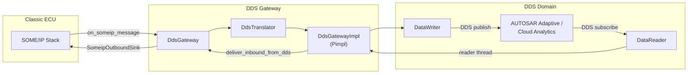

# SOME/IP ↔ DDS Gateway

Bridges **AUTOSAR Classic** SOME/IP traffic to **DDS** (Eclipse Cyclone DDS by default), enabling consumption by **AUTOSAR Adaptive** applications, cloud analytics, and defense/aerospace systems that communicate over OMG DDS.

!!! info "Repository"
    Source code: [`gateway-dds/`](https://github.com/vtz/opensomeip-gateways/tree/main/gateway-dds) |
    Ticket: [opensomeip-gateways#8](https://github.com/vtz/opensomeip-gateways/issues/8)

## Architecture



## Features

| Feature | Description |
|---------|-------------|
| DataWriter per service | Each SOME/IP service mapping gets its own DDS topic and writer |
| DataReader inbound thread | Background thread polls DDS readers, reconstructs SOME/IP messages |
| QoS policy mapping | SOME/IP message semantics drive DDS reliability, durability, and history |
| IDL wire type | `vehicle::SomeipBridgeSample` envelope carries service/instance/method IDs + payload |
| Translation modes | Opaque (raw bytes) or Typed (JSON envelope) |
| E2E protection | Validates inbound SOME/IP messages before bridging |
| Domain configuration | Cyclone DDS XML QoS profile file support |
| Pimpl isolation | `dds_gateway.h` does not expose any DDS SDK headers |

## QoS Mapping

### SOME/IP Message Type → DDS QoS

| SOME/IP Pattern | Reliability | Durability | History |
|----------------|-------------|------------|---------|
| Notification (event/UDP) | Best Effort | Volatile | Keep Last 1 |
| Request / Response / Error | Reliable | Volatile | Keep Last 16 |
| Default | Best Effort | Volatile | Keep Last 8 |

### Service Mapping → DDS QoS

| Mapping Type | Writer QoS | Reader QoS |
|-------------|------------|------------|
| Event-groups only (no methods) | Best Effort, Volatile, depth 1 | Reliable, Volatile, depth 16 |
| Methods present | Reliable, Transient Local, depth 8 | Reliable, Volatile, depth 16 |

!!! tip
    Fine-tune QoS per deployment using Cyclone DDS XML configuration via the `qos_profile_file` setting.

## Topic Naming

`DdsTranslator::build_dds_topic` produces hierarchical topic names:

```text
opensomeip/svc/0x6001/inst/0x0001/event/0x8001
opensomeip/svc/0x6001/inst/0x0001/method/0x0001
```

Override with `ServiceMapping::external_identifier` for integration with existing DDS topic graphs.

## IDL Wire Type

The gateway uses `SomeipBridgeSample` as the DDS wire type:

```idl
module vehicle {
    struct SomeipBridgeSample {
        unsigned short service_id;
        unsigned short instance_id;
        unsigned short method_or_event_id;
        octet          message_type;
        sequence<octet> payload;
    };
};
```

## opensomeip APIs Used

| API | Header | Usage |
|-----|--------|-------|
| [Message](../api/index.md) | `someip/message.h` | Construct / inspect SOME/IP messages |
| [Transport](../api/index.md#udp-transport) | `transport/udp_transport.h` | UDP listener for inbound SOME/IP |
| [Events](../api/events.md) | `events/event_publisher.h` | Publish SOME/IP events |
| [Events](../api/events.md) | `events/event_subscriber.h` | Subscribe to event groups |
| [RPC](../api/rpc.md) | `rpc/rpc_client.h` | Forward DDS commands as SOME/IP RPC |
| [Service Discovery](../api/sd.md) | `sd/sd_client.h` / `sd_server.h` | SOME/IP SD integration |
| [E2E](../api/e2e.md) | `e2e/e2e_protection.h` | Validate inbound message integrity |

## Configuration

```yaml
domain_id: 0
participant_name: "opensomeip-dds-gateway"
qos_profile_file: "/etc/opensomeip/cyclone_qos.xml"

someip:
  default_someip_instance_id: 0x0001
  enable_udp_listener: true
  udp_listen_address: "0.0.0.0"
  udp_listen_port: 30500

rpc_client_id: 0x7100

enable_sd_client: false
enable_sd_server: false
use_e2e: false

service_mappings:
  - someip_service_id: 0x6001
    someip_instance_id: 0x0001
    someip_event_group_ids: [0x0001]
    external_identifier: "vehicle/speed"
    direction: someip_to_external

  - someip_service_id: 0x6002
    someip_instance_id: 0x0001
    someip_method_ids: [0x0001]
    external_identifier: "vehicle/position"
    direction: bidirectional
```

## Example

```cpp
#include "opensomeip/gateway/dds/dds_gateway.h"

int main() {
    opensomeip::gateway::dds::DdsConfig config;
    config.domain_id = 0;
    config.participant_name = "adaptive-bridge";
    config.someip.enable_udp_listener = true;
    config.someip.udp_listen_endpoint = {"192.168.1.10", 30500};

    opensomeip::gateway::dds::DdsGateway gateway(config);

    opensomeip::gateway::ServiceMapping speed;
    speed.someip_service_id = 0x6001;
    speed.someip_instance_id = 0x0001;
    speed.someip_event_group_ids = {0x0001};
    speed.external_identifier = "vehicle/speed";
    speed.direction = opensomeip::gateway::GatewayDirection::SOMEIP_TO_EXTERNAL;
    gateway.add_service_mapping(speed);

    gateway.start();
    // Gateway bridges SOME/IP events to DDS until stopped
}
```

## Build

=== "Library"
    ```bash
    cmake -S opensomeip-gateways -B build \
        -DBUILD_GATEWAY_DDS=ON \
        -DCMAKE_PREFIX_PATH="/path/to/cyclonedds/install"
    cmake --build build --target opensomeip-gateway-dds
    ```

=== "Tests & Example"
    ```bash
    cmake --build build --target test_dds_gateway dds_adaptive_bridge
    ctest --test-dir build -R DdsGatewayTests
    ```

!!! warning "DDS Implementation"
    This gateway links against **Eclipse Cyclone DDS** (`CycloneDDS::ddsc`). Other DDS implementations (Fast DDS, RTI Connext) can be supported by replacing the Pimpl layer while keeping `DdsTranslator` and `DdsConfig` stable.
