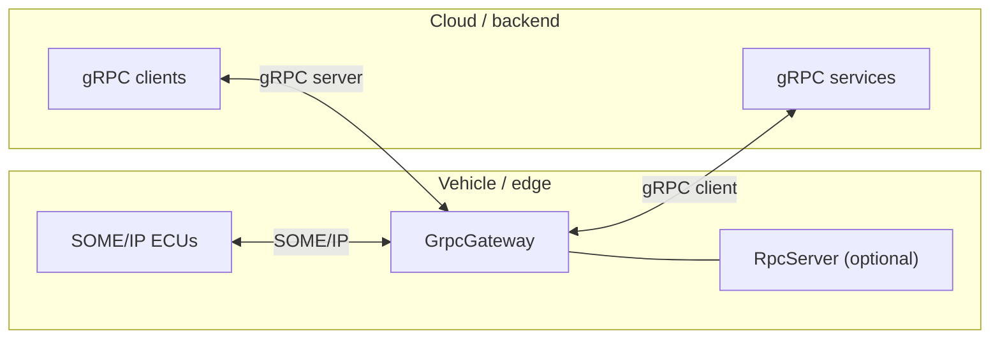

# SOME/IP ↔ gRPC Gateway

The **gRPC gateway** is a bidirectional bridge between OpenSOME/IP and [gRPC](https://grpc.io/). It runs in **dual role** on the vehicle or edge: it acts as a **gRPC server** so cloud or backend clients can call into SOME/IP services and subscribe to events, and as a **gRPC client** toward named cloud targets (for example OTA or digital-twin services) on behalf of the vehicle.

!!! info "Source repository"
    Implementation and examples live in [opensomeip-gateways](https://github.com/vtz/opensomeip-gateways) under `gateway-grpc/`.

## Architecture



- **Inbound from SOME/IP:** `on_someip_message()` maps traffic to gRPC unary calls or pushes event frames on server streams.
- **Inbound from gRPC:** The façade service `SomeIpGateway` accepts `UnarySomeIp` and `StreamSomeIpEvents`, then drives `RpcClient`, optional registered `RpcServer`, and cloud channels per `GrpcCloudTarget`.

## Features

| Capability | Description |
|------------|-------------|
| Unary RPC | SOME/IP request/response mirrored as `UnarySomeIp` with `SomeIpEnvelope` payloads. |
| Server-streaming | SOME/IP notifications forwarded as `EventFrame` messages on `StreamSomeIpEvents`. |
| Error mapping | `ReturnCode` and `RpcResult` translated to `grpc::Status` / `StatusCode`, and reverse for cloud replies. |
| TLS | Server credentials (cert chain, key, optional client CA, `require_client_cert`) and per-target client TLS (root CA, client cert/key, authority override). |
| Generic protobuf | `SomeIpEnvelope` carries service/instance/method, message type, return code, payload bytes, or a full serialized SOME/IP frame. |
| SD integration | Optional `SdClient` / `SdServer` wired from `GrpcConfig` for service discovery alongside the bridge. |

!!! tip "Schema-driven mode"
    YAML can describe per-mapping gRPC service names and proto paths (`schema_driven`); the generic envelope path still works without per-service `.proto` files at the vehicle.

## Error code mapping

Mappings are implemented in `GrpcTranslator` (`grpc_translator.cpp`). Unknown SOME/IP codes map to `UNKNOWN`; unknown gRPC codes map to `E_NOT_OK`.

=== "SOME/IP → gRPC"

| SOME/IP `ReturnCode` | gRPC `StatusCode` |
|----------------------|-------------------|
| `E_OK` | `OK` |
| `E_NOT_OK` | `INTERNAL` |
| `E_UNKNOWN_SERVICE` | `NOT_FOUND` |
| `E_UNKNOWN_METHOD` | `UNIMPLEMENTED` |
| `E_NOT_READY` | `FAILED_PRECONDITION` |
| `E_NOT_REACHABLE` | `UNAVAILABLE` |
| `E_TIMEOUT` | `DEADLINE_EXCEEDED` |
| `E_WRONG_PROTOCOL_VERSION` | `FAILED_PRECONDITION` |
| `E_WRONG_INTERFACE_VERSION` | `FAILED_PRECONDITION` |
| `E_MALFORMED_MESSAGE` | `INVALID_ARGUMENT` |
| `E_WRONG_MESSAGE_TYPE` | `INVALID_ARGUMENT` |
| `E_E2E_REPEATED` | `ABORTED` |
| `E_E2E_WRONG_SEQUENCE` | `ABORTED` |
| `E_E2E` | `DATA_LOSS` |
| `E_E2E_NOT_AVAILABLE` | `UNAVAILABLE` |
| `E_E2E_NO_NEW_DATA` | `FAILED_PRECONDITION` |

=== "gRPC → SOME/IP"

| gRPC `StatusCode` | SOME/IP `ReturnCode` |
|---------------------|----------------------|
| `OK` | `E_OK` |
| `CANCELLED` | `E_NOT_OK` |
| `UNKNOWN` | `E_NOT_OK` |
| `INVALID_ARGUMENT` | `E_MALFORMED_MESSAGE` |
| `DEADLINE_EXCEEDED` | `E_TIMEOUT` |
| `NOT_FOUND` | `E_UNKNOWN_SERVICE` |
| `ALREADY_EXISTS` | `E_NOT_OK` |
| `PERMISSION_DENIED` | `E_NOT_OK` |
| `RESOURCE_EXHAUSTED` | `E_NOT_READY` |
| `FAILED_PRECONDITION` | `E_NOT_READY` |
| `ABORTED` | `E_E2E` |
| `OUT_OF_RANGE` | `E_MALFORMED_MESSAGE` |
| `UNIMPLEMENTED` | `E_UNKNOWN_METHOD` |
| `INTERNAL` | `E_NOT_OK` |
| `UNAVAILABLE` | `E_NOT_REACHABLE` |
| `DATA_LOSS` | `E_E2E` |
| `UNAUTHENTICATED` | `E_NOT_OK` |

`someip::rpc::RpcResult` is first reduced to `ReturnCode`, then to gRPC (for example `SUCCESS` → `E_OK` → `OK`, `TIMEOUT` → `E_TIMEOUT` → `DEADLINE_EXCEEDED`).

## OpenSOME/IP APIs used

| API | Role in gateway |
|-----|-----------------|
| [`someip::Message`](../api/index.md) | Parse, build, and forward SOME/IP frames. |
| [`someip::rpc::RpcClient`](../api/rpc.md) | Outbound SOME/IP method calls from gRPC or cloud path. |
| [`someip::rpc::RpcServer`](../api/rpc.md) | Optional per-service server registered with `register_vehicle_rpc_server()`. |
| [`someip::events::EventSubscriber`](../api/events.md) | Subscribe to event groups feeding streams. |
| [`someip::sd::SdClient`](../api/sd.md) / [`SdServer`](../api/sd.md) | Optional discovery client/server. |
| [`someip::e2e::E2EProtection`](../api/e2e.md) | Optional E2E bridge when enabled in config. |
| [`Serialization`](../api/serialization.md) | Payload helpers for message encoding/decoding. |

## Configuration reference (YAML)

Top-level shape follows the example under `gateway-grpc/examples/grpc_config.yaml`. Fields align with `GrpcConfig` / `GrpcConfigCore` in `grpc_config.h`.

```yaml
gateway:
  name: "vehicle-grpc-bridge"
  log_level: info

  grpc:
    server:
      listen_address: "0.0.0.0:50051"
      tls:
        enabled: true
        cert_chain: "/etc/gateway/server.pem"
        private_key: "/etc/gateway/server.key"
        client_ca: "/etc/gateway/ca.pem"
        require_client_cert: true
      max_concurrent_streams: 100

    client_targets:
      - name: "ota_service"
        address: "ota.cloud.example.com:443"
        tls:
          enabled: true
          root_ca: "/etc/gateway/cloud-ca.pem"

  someip:
    bridge_client_id: 0x7001
    rpc_response_timeout_ms: 5000

  service_mappings:
    - someip:
        service_id: 0x1234
        instance_id: 0x0001
        methods: [0x0001, 0x0002]
        event_groups: [0x0001]
      grpc:
        service: "vehicle.gateway.RadarService"
        proto_file: "protos/radar.proto"
      mode: schema_driven
      direction: bidirectional
```

| YAML / struct area | Meaning |
|--------------------|---------|
| `server.listen_address` | Binds the vehicle-side gRPC server (`server_listen_address`). |
| `server.tls` | Maps to `GrpcTlsServerOptions` (paths, `require_client_cert`). |
| `max_concurrent_streams` | gRPC server stream limit. |
| `client_targets[]` | Named `GrpcCloudTarget` entries (`grpc_uri`, client TLS). |
| `someip.bridge_client_id` | SOME/IP client ID for the bridge (`someip_bridge_client_id`). |
| `someip.rpc_response_timeout_ms` | RPC wait timeout (`rpc_response_timeout`). |

SD and E2E toggles are available on `GrpcConfigCore` (`enable_sd_client`, `enable_sd_server`, `enable_e2e_bridge` and nested configs) when your loader wires them.

## C++ usage example

Minimal pattern from `examples/grpc_digital_twin.cpp`: construct `GrpcConfig`, register `ServiceMapping` rows (gRPC service name in `external_identifier`), then `start()` and feed `on_someip_message()`.

```cpp
#include "opensomeip/gateway/grpc/grpc_gateway.h"
#include "serialization/serializer.h"
#include "someip/message.h"

using namespace opensomeip::gateway;
using namespace opensomeip::gateway::grpc;

int main() {
    GrpcConfig config;
    config.server_listen_address = "0.0.0.0:50051";
    config.someip_bridge_client_id = 0x7001;

    GrpcGateway gateway(config);

    ServiceMapping radar;
    radar.someip_service_id = 0x1234;
    radar.someip_instance_id = 0x0001;
    radar.someip_method_ids = {0x0001, 0x0002};
    radar.someip_event_group_ids = {0x0001};
    radar.external_identifier = "vehicle.gateway.RadarService";
    radar.direction = GatewayDirection::BIDIRECTIONAL;
    gateway.add_service_mapping(radar);

    gateway.start();

    someip::MessageId msg_id(0x1234, 0x0001);
    someip::RequestId req_id(0x0042, 0x0001);
    someip::Message request(msg_id, req_id, someip::MessageType::REQUEST);
    someip::serialization::Serializer ser;
    ser.serialize_uint32(200);
    request.set_payload(ser.get_buffer());
    gateway.on_someip_message(request);

    gateway.stop();
    return 0;
}
```

Use `gateway.translator().someip_to_grpc_status()` / `grpc_status_code_to_return_code()` when you need explicit status conversion outside the service stub.

## Build instructions

The target **`opensomeip-gateway-grpc`** requires **gRPC** and **Protobuf** (`find_package(gRPC)` and `find_package(Protobuf)` must succeed); the library defines `HAVE_GRPC=1` when both are found.

```bash
cd opensomeip-gateways
cmake -S . -B build -DBUILD_GATEWAY_GRPC=ON
cmake --build build
```

With examples:

```bash
cmake -S . -B build -DBUILD_GATEWAY_GRPC=ON -DBUILD_EXAMPLES=ON
cmake --build build
./build/bin/grpc_digital_twin
```

!!! warning "Dependency"
    Install gRPC and Protobuf development packages (or use a toolchain that provides `gRPC::grpc++` and `protobuf::libprotobuf`) before enabling this gateway.

## Tracking

Design discussion and roadmap: [GitHub issue #4 — gRPC gateway](https://github.com/vtz/opensomeip-gateways/issues/4).
