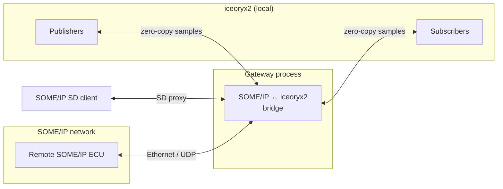

# SOME/IP ↔ iceoryx2 Gateway

Bidirectional bridge between SOME/IP (via [OpenSOME/IP](https://github.com/vtz/opensomeip)) and [Eclipse iceoryx2](https://github.com/eclipse-iceoryx/iceoryx2) zero-copy shared-memory IPC.

!!! note "Use case"
    Use this gateway on a single ECU or SoC where a classic SOME/IP stack must talk to local applications that prefer iceoryx2 pub/sub and request-response, without copying payloads through the network stack. Typical patterns include radar or sensor fusion on one processor with ADAS consumers on another core via shared memory.

## Architecture



!!! tip "In-process simulation"
    The gateway can run with an in-process shared-memory simulation so you can develop and test without installing the full iceoryx2 runtime.

## Features

- Pub/sub bridge: SOME/IP events ↔ iceoryx2 publisher/subscriber
- Request-response bridge: SOME/IP RPC methods ↔ iceoryx2 client/server
- SD proxy: SOME/IP Service Discovery offers exposed as iceoryx2 service names
- In-process simulation for tests and demos without iceoryx2 installed
- Configurable per-service mappings (YAML or programmatic C++ API)
- Optional UDP listener for raw SOME/IP frames

## OpenSOME/IP APIs used

| API | Role in gateway | Documentation |
|-----|-----------------|---------------|
| `Message`, `MessageId`, `RequestId`, `MessageType` | Build and parse SOME/IP messages for both directions | [API overview](../api/index.md#core-types) |
| `Serializer` / `Deserializer` | Binary **Iceoryx2Envelope** layout on the wire | [Serialization](../api/serialization.md) |
| `EventPublisher` / `EventSubscriber` | Event path toward/from the SOME/IP stack | [Events](../api/events.md) |
| `RpcClient` / `RpcServer` | Method call bridging | [RPC](../api/rpc.md) |
| `SdClient` / `SdServer` | Service discovery proxy | [Service Discovery](../api/sd.md) |
| `UdpTransport` / `Endpoint` | Optional inbound SOME/IP over UDP | [API overview](../api/index.md) (see Quick Example) |

## Iceoryx2 envelope format

Each iceoryx2 sample that carries SOME/IP semantics uses a single binary **envelope** (opaque on the wire unless you enable typed/JSON mode in the translator). Layout is written with OpenSOME/IP [`Serializer`](../api/serialization.md) / [`Deserializer`](../api/serialization.md) (big-endian fields).

| Field | Type | Meaning |
|-------|------|---------|
| Magic | `uint32` | Constant `0x53495031` (`SIP1`) |
| Version | `uint8` | Envelope version (currently `1`) |
| Mode | `uint8` | Translation mode (opaque vs typed) |
| Service ID | `uint16` | SOME/IP service identifier |
| Instance ID | `uint16` | SOME/IP instance (from mapping context) |
| Method or event ID | `uint16` | Method ID or event ID from the SOME/IP header |
| Message type | `uint8` | SOME/IP [`MessageType`](../api/index.md#core-types) |
| Reserved | `uint8` | Padding |
| Client ID | `uint16` | From SOME/IP request header |
| Session ID | `uint16` | From SOME/IP request header |
| Correlation ID | length-prefixed string | e.g. `client`–`session` for RPC correlation |
| Payload | `uint32` length + bytes | Raw SOME/IP payload (opaque) or typed representation |

The gateway turns an inbound SOME/IP message into this envelope, publishes it on the computed iceoryx2 service name, and reverses the process for outbound samples.

## Service name mapping

Fully qualified iceoryx2 service strings are built from the configured prefix, hex-formatted SOME/IP identifiers, and a **kind** tag that distinguishes traffic shape:

```text
{prefix}/{sid}/{iid}/{mid}/{kind}
```

- `{prefix}` — YAML `iceoryx2.service_name_prefix` or `Iceoryx2Config::service_name_prefix` (e.g. `vehicle/ecu1/someip`).
- `{sid}`, `{iid}`, `{mid}` — Lowercase hex strings such as `0x1234`, `0x0001`, `0x8001` (via `format_service_id`).
- `{kind}` — Single ASCII character:
    - **`N`** — Event notification path (SOME/IP `NOTIFICATION` on the pub/sub bridge).
    - **`P`** — Other pub/sub-oriented messages on the same bridge (non-notification).
    - **`R`** — RPC path (requests, responses, and related RPC traffic).

Declarative mappings in YAML still attach a logical **`iceoryx2.service`** name (e.g. `radar/front`); the gateway combines that with the prefix and IDs above when publishing.

## Configuration reference

Full examples live in the [opensomeip-gateways](https://github.com/vtz/opensomeip-gateways) tree at `gateway-iceoryx2/examples/iceoryx2_config.yaml`. Minimal shape:

```yaml
gateway:
  name: "radar-iceoryx2-bridge"
  log_level: info

  iceoryx2:
    service_name_prefix: "vehicle/ecu1/someip"
    shared_memory:
      max_sample_bytes: 65536
      subscriber_max_buffer_size: 8
      publisher_history_size: 1
      max_publishers: 8
      max_subscribers: 16
      enable_safe_overflow: true

  someip:
    client_id: 0x4200
    sd_proxy: true
    udp_listener:
      enabled: false
      address: "0.0.0.0"
      port: 30500

  service_mappings:
    - someip:
        service_id: 0x1234
        instance_id: 0x0001
        event_groups: [0x0001]
      iceoryx2:
        service: "radar/front"
      mode: opaque
      direction: bidirectional
```

!!! info "Modes and direction"
    `mode` selects opaque binary vs typed translation; `direction` limits flow (SOME/IP→iceoryx2, reverse, or both).

## C++ usage example

The flow follows `gateway-iceoryx2/examples/iceoryx2_bridge_example.cpp` (configure, map services, start, drive SOME/IP notifications). For the iceoryx2→SOME/IP path, the excerpt uses `Iceoryx2MessageTranslator::someip_to_sample()` to build envelope bytes, which matches the public translator API.

=== "Program (excerpt)"

    ```cpp
    #include "opensomeip/gateway/iceoryx2/iceoryx2_gateway.h"
    #include "serialization/serializer.h"
    #include "someip/message.h"

    #include <iostream>

    int main() {
        using namespace opensomeip::gateway;
        using namespace opensomeip::gateway::iceoryx2;

        Iceoryx2Config config;
        config.gateway_name = "radar-iceoryx2-bridge";
        config.service_name_prefix = "vehicle/ecu1/someip";
        config.use_inprocess_shm_simulation = true;
        config.shm.max_sample_bytes = 4096;

        Iceoryx2Gateway gateway(config);

        ServiceMapping radar_events;
        radar_events.someip_service_id = 0x1234;
        radar_events.someip_instance_id = 0x0001;
        radar_events.someip_event_group_ids = {0x0001};
        radar_events.external_identifier = "radar/front";
        radar_events.direction = GatewayDirection::BIDIRECTIONAL;
        radar_events.mode = TranslationMode::OPAQUE;
        gateway.add_service_mapping(radar_events);

        auto result = gateway.start();
        if (result != someip::Result::SUCCESS) {
            return 1;
        }

        // SOME/IP notification → iceoryx2
        someip::MessageId msg_id(0x1234, 0x8001);
        someip::RequestId req_id(0x0000, 0x0001);
        someip::Message notification(msg_id, req_id, someip::MessageType::NOTIFICATION);
        someip::serialization::Serializer ser;
        ser.serialize_float(42.5f);
        notification.set_payload(ser.get_buffer());
        gateway.on_someip_message(notification);

        // iceoryx2 sample → SOME/IP (build envelope via public translator API)
        Iceoryx2MessageTranslator translator;
        someip::MessageId inj_id(0x1234, 0x8001);
        someip::RequestId inj_rid(0x0000, 0x0001);
        someip::Message inject_msg(inj_id, inj_rid, someip::MessageType::NOTIFICATION);
        ser = someip::serialization::Serializer{};
        ser.serialize_double(55.123);
        ser.serialize_double(8.456);
        inject_msg.set_payload(ser.get_buffer());
        auto bytes = translator.someip_to_sample(inject_msg, 0x0001, TranslationMode::OPAQUE);
        gateway.inject_iceoryx2_sample(
            "vehicle/ecu1/someip/0x1234/0x0001/0x8001/N", bytes);

        gateway.stop();
        return 0;
    }
    ```

=== "Run the bundled example"

    ```bash
    ./bin/iceoryx2_bridge_example
    ```

## Build instructions

Clone [opensomeip-gateways](https://github.com/vtz/opensomeip-gateways), enable the iceoryx2 target, build, and run tests.

=== "Configure and build"

    ```bash
    cd opensomeip-gateways
    cmake -B build -S . -DBUILD_GATEWAY_ICEORYX2=ON
    cmake --build build -j"$(nproc 2>/dev/null || sysctl -n hw.ncpu)"
    ```

=== "Tests"

    ```bash
    ctest --test-dir build --output-on-failure -R Iceoryx2
    ```

## Tracking

Gateway design discussion and roadmap: [GitHub issue #2](https://github.com/vtz/opensomeip-gateways/issues/2).
