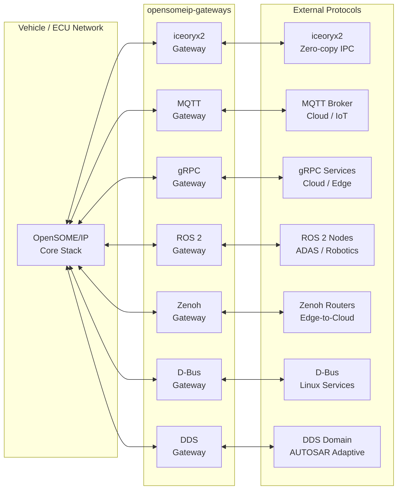

# Protocol Gateways

The **opensomeip-gateways** ecosystem provides bidirectional protocol bridges between SOME/IP and widely-used communication middlewares. Each gateway is an independent CMake target with its own dependencies, tests, and examples.

!!! info "Repository"
    Gateway source code lives in the dedicated [opensomeip-gateways](https://github.com/vtz/opensomeip-gateways) repository.

## Architecture Overview



## Gateway Catalog

| Gateway | Protocol | Tier | Key Use Case | Page |
|---------|----------|------|--------------|------|
| [iceoryx2](iceoryx2.md) | Zero-copy IPC | 1 | Intra-ECU / intra-SoC bridging | [Details →](iceoryx2.md) |
| [MQTT](mqtt.md) | MQTT 5.0 | 1 | Vehicle-to-cloud telemetry & commands | [Details →](mqtt.md) |
| [gRPC](grpc.md) | HTTP/2 + Protobuf | 1 | Service-oriented cloud integration | [Details →](grpc.md) |
| [ROS 2](ros2.md) | DDS (rmw) | 2 | ADAS / autonomous driving / robotics | [Details →](ros2.md) |
| [Zenoh](zenoh.md) | Zenoh protocol | 2 | Edge-to-cloud pub/sub routing | [Details →](zenoh.md) |
| [D-Bus](dbus.md) | Linux IPC | 2 | Linux system service integration | [Details →](dbus.md) |
| [DDS](dds.md) | OMG DDS | 3 | AUTOSAR Adaptive / aerospace / defense | [Details →](dds.md) |

## Common Library

All gateways share a common foundation:

- **`IGateway`** — Interface: `start()`, `stop()`, `on_someip_message()`, stats
- **`GatewayBase`** — Base class with service mapping, direction filtering, atomic counters, reusable UDP bridge listener
- **`MessageTranslator`** — Topic naming, hex formatting, JSON envelope, opaque/typed payload conversion
- **`ServiceMapping`** — Declarative per-service routing with direction and translation mode
- **`GatewayStats`** — Lock-free atomic counters for messages, bytes, errors, uptime

See [Architecture](architecture.md) for the full design.

## Quick Start

```bash
git clone https://github.com/vtz/opensomeip-gateways.git
cd opensomeip-gateways

# Build with specific gateways enabled
cmake -B build -S . \
    -DBUILD_GATEWAY_ICEORYX2=ON \
    -DBUILD_GATEWAY_MQTT=ON \
    -DBUILD_TESTS=ON

cmake --build build
ctest --test-dir build
```

Each gateway has its own `BUILD_GATEWAY_<NAME>` option (all `OFF` by default) and requires its protocol's SDK to be installed.

## opensomeip APIs Used

Every gateway integrates with the opensomeip core stack through these APIs:

| API | Header | Usage |
|-----|--------|-------|
| [Message](../api/index.md) | `someip/message.h` | SOME/IP message creation, serialization |
| [Transport](../api/index.md#udp-transport) | `transport/udp_transport.h` | UDP listener for inbound SOME/IP |
| [Events](../api/events.md) | `events/event_publisher.h` | Publish SOME/IP events toward the network |
| [Events](../api/events.md) | `events/event_subscriber.h` | Subscribe to SOME/IP event groups |
| [RPC](../api/rpc.md) | `rpc/rpc_client.h` | Send SOME/IP method calls |
| [RPC](../api/rpc.md) | `rpc/rpc_server.h` | Handle incoming SOME/IP method calls |
| [Service Discovery](../api/sd.md) | `sd/sd_client.h` | Find SOME/IP services |
| [Service Discovery](../api/sd.md) | `sd/sd_server.h` | Offer SOME/IP services |
| [E2E Protection](../api/e2e.md) | `e2e/e2e_protection.h` | End-to-end data integrity validation |
| [Serialization](../api/serialization.md) | `serialization/serializer.h` | Binary envelope encoding |

## Contributing

See [Adding a Gateway](contributing.md) for how to implement a new protocol gateway.
