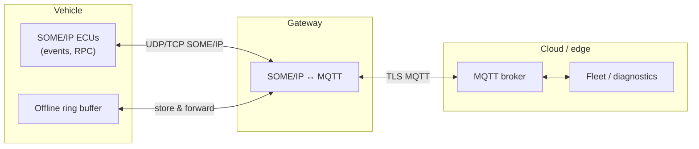

# SOME/IP ↔ MQTT Gateway

Bidirectional bridge between SOME/IP (via [OpenSOME/IP](https://github.com/vtz/opensomeip)) and [MQTT](https://mqtt.org/), aimed at fleet telemetry, remote diagnostics, cloud command-and-control, and general IoT integration.

!!! note "Use case"
    Vehicle ECUs already speak SOME/IP on the wire; cloud backends and mobile apps typically speak MQTT. This gateway translates between the two, including topic layout, QoS, payload encoding, and optional TLS, so you can stream events and invoke RPC-style flows without rewriting in-vehicle software.

## Architecture



## Features

| Area | Capability |
|------|------------|
| Pub/sub | SOME/IP events to MQTT topics and reverse where configured |
| Request-response | SOME/IP RPC correlated with MQTT v5 request-response when enabled |
| Security | TLS/mTLS to the broker (`mqtts://`, client certs) |
| QoS | Per-event/per-method or default publish/subscribe QoS (0/1/2) |
| Resilience | Ring buffer for offline periods; reconnect with exponential backoff |
| LWT | Last Will and Testament for online/offline status on a dedicated topic |
| Payload encoding | **RAW**, **JSON**, or **SOMEIP_FRAMED** for outbound/inbound |
| Integrity | Optional SOME/IP E2E validation before forwarding |
| Multi-tenant topics | VIN-scoped namespaces: `vehicle/{vin}/someip/...` |

!!! tip "Encoding"
    Use **JSON** for human-readable cloud pipelines, **RAW** for minimal overhead, and **SOMEIP_FRAMED** when downstream tools expect a full SOME/IP-style payload wrapper.

## MQTT topic structure

Canonical topic templates (hex IDs are formatted like `0x1000`, consistent with the gateway):

| Topic pattern | Purpose |
|---------------|---------|
| `vehicle/{vin}/someip/{service_id}/{instance_id}/event/{event_group_id}` | Event notifications |
| `vehicle/{vin}/someip/{service_id}/{instance_id}/method/{method_id}/request` | RPC request |
| `vehicle/{vin}/someip/{service_id}/{instance_id}/method/{method_id}/response` | RPC response |
| `vehicle/{vin}/someip/sd/status` | Last Will / presence (`online` / `offline`) |

!!! info "Prefix and event segment"
    Configurable `topic_prefix` (default `vehicle`) prepends instead of the literal `vehicle` when set. The gateway builds the `event/...` segment from the SOME/IP header field that carries the event ID for notifications (often `0x8xxx`); align your YAML mappings with how that ID relates to event groups in your service model.

## QoS mapping

### By SOME/IP message role

The gateway selects MQTT QoS from whether traffic is event-like or RPC-like, combined with per-mapping overrides and defaults:

| SOME/IP role | MQTT QoS selection | Typical default |
|--------------|-------------------|-----------------|
| Notifications / events (`NOTIFICATION`, event routing) | Per-event override, else `defaults.publish_qos` | Often **0** for high-rate telemetry |
| RPC (`REQUEST`, responses, errors) | Per-method override, else RPC default (implementation uses **1** when unset) | Often **1** (at-least-once) |

Underlying helper logic treats **notifications** as the event path and **requests** as the RPC path when choosing baseline QoS before applying YAML overrides.

### Operational guidelines (transport vs criticality)

These are recommended pairings from the gateway README; tune per service in YAML.

| Data type | SOME/IP transport | MQTT QoS | Rationale |
|-----------|-------------------|----------|-----------|
| Telemetry (periodic) | UDP events | 0 | Best-effort, high frequency |
| Control commands | RPC | 1 | At-least-once delivery |
| Diagnostic / safety-critical | TCP RPC | 2 | Stricter delivery where the broker and clients support it |

## OpenSOME/IP APIs used

| API | Role in gateway | Documentation |
|-----|-----------------|---------------|
| `Message`, `Serializer`, `Deserializer` | MQTT payload packing and SOME/IP reconstruction | [API overview](../api/index.md#core-types), [Serialization](../api/serialization.md) |
| `EventPublisher` / `EventSubscriber` | Event bridge toward SOME/IP | [Events](../api/events.md) |
| `RpcClient` / `RpcServer` | Method call bridge | [RPC](../api/rpc.md) |
| `SdClient` / `SdServer` | Service discovery integration | [Service Discovery](../api/sd.md) |
| `UdpTransport` / `Endpoint` | Optional SOME/IP UDP listener | [API overview](../api/index.md) |
| `E2EProtection` | Optional end-to-end checks before publish | [E2E Protection](../api/e2e.md) |

## Configuration reference

See `gateway-mqtt/examples/mqtt_config.yaml` in [opensomeip-gateways](https://github.com/vtz/opensomeip-gateways). Condensed example:

```yaml
gateway:
  name: "vehicle-telemetry-gw"
  log_level: info

  mqtt:
    broker: "mqtts://fleet.example.com:8883"
    client_id: "vehicle-${vin}"
    protocol_version: 5
    keepalive_seconds: 60
    clean_session: true
    tls:
      enabled: true
      ca_cert: "/etc/gateway/ca.pem"
      client_cert: "/etc/gateway/client.pem"
      client_key: "/etc/gateway/client.key"
    reconnect:
      auto: true
      min_delay_ms: 1000
      max_delay_ms: 60000
    last_will:
      enabled: true
      topic: "vehicle/${vin}/someip/sd/status"
      payload: "offline"
      qos: 1
      retain: true
    defaults:
      publish_qos: 1
      subscribe_qos: 1
      outbound_encoding: json   # raw, json, someip_framed
      inbound_encoding: raw
    offline_buffer_capacity: 512

  vin: "WBA12345678901234"
  topic_prefix: "vehicle"

  someip:
    local_address: "0.0.0.0"
    local_port: 30500
    sd_multicast: "239.255.255.250"
    sd_port: 30490

  service_mappings:
    - someip:
        service_id: 0x1000
        instance_id: 0x0001
        event_groups: [0x0001]
      mqtt:
        topic_prefix: "vehicle/${vin}/telemetry/speed"
        qos: 0
        encoding: json
      direction: someip_to_mqtt
```

!!! warning "Secrets"
    Keep broker URLs, VINs, and certificate paths out of public repositories; inject them at deploy time in production.

## C++ usage example

Based on `gateway-mqtt/examples/mqtt_vehicle_telemetry.cpp`: configure broker and VIN, map a speed event stream and a door-lock RPC, then exercise publish and offline buffering.

=== "Program (excerpt)"

    ```cpp
    #include "opensomeip/gateway/mqtt/mqtt_gateway.h"
    #include "serialization/serializer.h"
    #include "someip/message.h"

    #include <iostream>

    int main() {
        using namespace opensomeip::gateway;

        MqttConfig config;
        config.broker_uri = "tcp://localhost:1883";
        config.client_id = "vehicle-telemetry-gw";
        config.topic_prefix = "vehicle";
        config.vin = "WBA12345678901234";
        config.default_publish_qos = 1;
        config.outbound_encoding = MqttPayloadEncoding::JSON;
        config.offline_buffer_capacity = 512;
        config.use_mqtt_v5_request_response = true;

        MqttGateway gateway(config);

        ServiceMapping speed;
        speed.someip_service_id = 0x1000;
        speed.someip_instance_id = 0x0001;
        speed.someip_event_group_ids = {0x0001};
        speed.external_identifier = "telemetry/speed";
        speed.direction = GatewayDirection::SOMEIP_TO_EXTERNAL;
        speed.mode = TranslationMode::OPAQUE;
        gateway.add_service_mapping(speed);

        ServiceMapping door_lock;
        door_lock.someip_service_id = 0x2000;
        door_lock.someip_instance_id = 0x0001;
        door_lock.someip_method_ids = {0x0001};
        door_lock.external_identifier = "command/door_lock";
        door_lock.direction = GatewayDirection::BIDIRECTIONAL;
        gateway.add_service_mapping(door_lock);

        gateway.set_someip_outbound_sink([](const someip::Message& msg) {
            std::cout << "SOME/IP outbound: service=0x" << std::hex
                      << msg.get_service_id() << std::dec << "\n";
        });

        gateway.start();
        gateway.test_set_mqtt_connected(true);

        someip::MessageId msg_id(0x1000, 0x8001);
        someip::RequestId req_id(0x0000, 0x0001);
        someip::Message notification(msg_id, req_id, someip::MessageType::NOTIFICATION);
        someip::serialization::Serializer ser;
        ser.serialize_float(120.5f);
        notification.set_payload(ser.get_buffer());
        gateway.on_someip_message(notification);

        gateway.test_set_mqtt_connected(false);
        gateway.on_someip_message(notification);
        gateway.test_set_mqtt_connected(true);
        gateway.flush_offline_buffer();

        gateway.stop();
        return 0;
    }
    ```

=== "Run the bundled example"

    ```bash
    ./bin/mqtt_vehicle_telemetry
    ```

## Build instructions

Install Paho MQTT C++ when linking against a real broker (optional for stubbed tests).

=== "Dependencies (Debian/Ubuntu)"

    ```bash
    sudo apt install libpaho-mqttpp-dev libpaho-mqtt-dev
    ```

=== "Configure, build, and test"

    ```bash
    cd opensomeip-gateways
    cmake -B build -S . -DBUILD_GATEWAY_MQTT=ON
    cmake --build build -j"$(nproc 2>/dev/null || sysctl -n hw.ncpu)"
    ctest --test-dir build --output-on-failure -R Mqtt
    ```

## Tracking

Feature scope and integration notes: [GitHub issue #3](https://github.com/vtz/opensomeip-gateways/issues/3).
