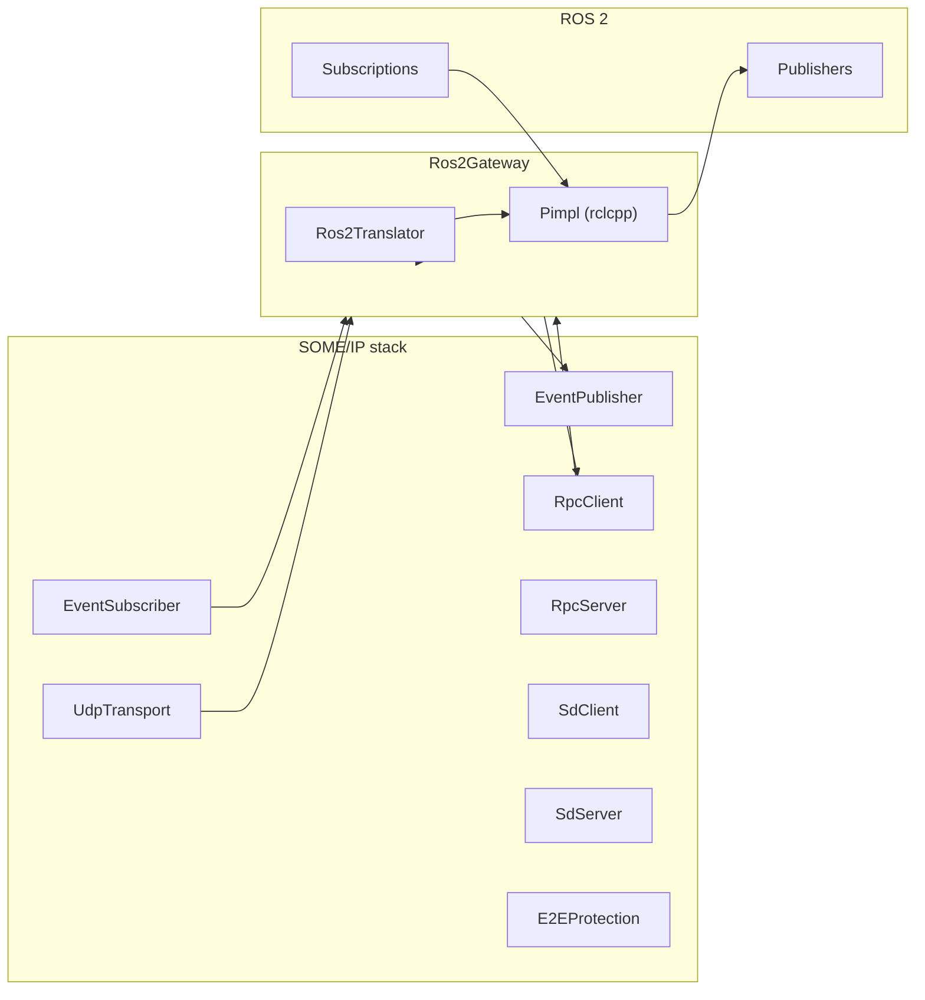

# SOME/IP ↔ ROS 2 Gateway

The **ROS 2 gateway** connects OpenSOME/IP to ROS 2 for **ADAS**, **autonomous driving**, and **robotics** stacks. It reuses `opensomeip-gateway-common` (`GatewayBase`, `ServiceMapping`, translators, statistics, direction enums) so routing and observability stay consistent with other gateways.

!!! info "Source repository"
    Implementation and examples live in [opensomeip-gateways](https://github.com/vtz/opensomeip-gateways) under `gateway-ros2/`.

## Architecture



- **SOME/IP → ROS 2:** `on_someip_message()` resolves `ServiceMapping`, optionally validates E2E, converts payload with `Ros2Translator`, then publishes via rclcpp as `std_msgs/msg/UInt8MultiArray` (or a test callback when ROS is not linked).
- **ROS 2 → SOME/IP:** Subscriptions call `inject_ros2_message()`, which builds a SOME/IP request and dispatches via `RpcClient` or an optional `someip_outbound_sink`.

## Features

| Capability | Description |
|------------|-------------|
| Pub/sub | Event notifications become ROS publishes; command topics drive inbound traffic. |
| Request–response | SOME/IP RPC via `RpcClient` / `RpcServer` attachments; ROS side uses opaque byte payloads for commands. |
| QoS mapping | `Ros2Translator::qos_for_someip_transport()` maps a SOME/IP transport hint to `Ros2QosProfile` (reliability, history, durability). |
| E2E validation | Optional `E2EProtection` when `use_e2e` and config are enabled. |
| rclcpp integration | With `rclcpp` and `std_msgs` at configure time, `OPENSOMEIP_GATEWAY_ROS2_HAS_RCLCPP` is defined and the pimpl creates nodes, publishers, and subscriptions. |
| Opaque byte bridge | Payloads are raw bytes in `UInt8MultiArray`; no ROS `.msg` code generation per SOME/IP service is required for the default path. |

## QoS mapping

`Ros2QosProfile` fields are consumed by the gateway implementation when building rclcpp QoS. **Volatile** means `durability_transient_local == false`.

| `SomeipTransportKind` | Reliable | `history_depth` | Durability |
|-----------------------|----------|-----------------|------------|
| `UDP_UNICAST` | no | 5 | volatile |
| `UDP_MULTICAST` | no | 5 | volatile |
| `TCP` | yes | 10 | volatile |

Set `Ros2Config::default_someip_transport` to match how events are delivered on the vehicle bus.

## Topic naming

Default ROS topic shape built by `Ros2Translator::build_ros2_topic()`:

```text
{namespace}/{topic_prefix}/{service_id}/{instance_id}/event/{event_id}
```

Each of `service_id`, `instance_id`, and `event_id` is formatted as **uppercase hex** with `0x` prefix and four digits (for example `0x1234`).

If `ServiceMapping::external_identifier` is set, it **overrides** this pattern for that mapping (for example a stable name like `/vehicle/adas/speed_ms`).

!!! note "Namespace"
    `ros_namespace` should usually start with `/` (for example `/vehicle`). The translator normalizes a leading slash and trims trailing slashes.

## OpenSOME/IP APIs used

| API | Role in gateway |
|-----|-----------------|
| `someip::Message`, `MessageId`, `RequestId`, `MessageType`, `ReturnCode` | Core message model. |
| [`someip::serialization::Serializer` / `Deserializer`](../api/serialization.md) | Examples and typed payloads. |
| [`someip::events::EventPublisher`](../api/events.md) / [`EventSubscriber`](../api/events.md) | Events in/out of SOME/IP. |
| [`someip::rpc::RpcClient`](../api/rpc.md) / [`RpcServer`](../api/rpc.md) | Method calls and servers. |
| [`someip::sd::SdClient`](../api/sd.md) / [`SdServer`](../api/sd.md) | Optional SD. |
| [`someip::transport::UdpTransport`](../api/tp.md), `Endpoint` | Optional UDP bridge. |
| [`someip::e2e::E2EProtection`](../api/e2e.md), `E2EConfig` | Optional E2E. |
| `someip::Result` | Lifecycle and `on_someip_message` results. |

## Configuration reference (YAML)

Reference layout from `examples/ros2_config.yaml`. Runtime loading is application-specific; fields align with `Ros2Config` and feature flags.

```yaml
ros2:
  node_name: opensomeip_ros2_gateway
  namespace: /vehicle
  topic_prefix: someip

someip:
  bind_address: 0.0.0.0
  bind_port: 30500
  rpc_client_id: 0x5100
  default_instance_id: 0x0001

features:
  enable_udp_transport: false
  enable_rpc_client: true
  enable_rpc_server: false
  enable_sd_client: false
  enable_sd_server: false
  enable_event_subscriber: true
  use_e2e: false

service_mappings:
  - someip_service_id: 0x6001
    someip_instance_id: 0x0001
    ros_topic: /vehicle/adas/speed_ms
    direction: someip_to_ros2
    someip_method_ids: []
    someip_event_group_ids: [0x0001]

  - someip_service_id: 0x6002
    someip_instance_id: 0x0001
    ros_topic: /vehicle/adas/steering_command
    direction: ros2_to_someip
    someip_method_ids: [0x0001]
    someip_event_group_ids: []
```

| Area | Maps to |
|------|---------|
| `ros2.node_name` | `Ros2Config::node_name` |
| `ros2.namespace` | `ros_namespace` |
| `ros2.topic_prefix` | `topic_prefix` |
| `someip.*` | Bind address/port, `rpc_client_id`, `default_someip_instance_id` |
| `features.*` | `enable_*` and `use_e2e` toggles |
| `service_mappings[]` | `ServiceMapping` (`external_identifier` from `ros_topic` or equivalent) |

Directions in C++ are `GatewayDirection::SOMEIP_TO_EXTERNAL`, `EXTERNAL_TO_SOMEIP`, or `BIDIRECTIONAL` (YAML may use snake_case aliases depending on your loader).

## C++ usage example

From `examples/ros2_adas_bridge.cpp`: set `Ros2Config`, add mappings with `external_identifier` as the ROS topic, call `start()`, then drive `on_someip_message()` and/or ROS publishers and `inject_ros2_message()`.

```cpp
#include "opensomeip/gateway/ros2/ros2_gateway.h"
#include "serialization/serializer.h"
#include "someip/types.h"

opensomeip::gateway::ros2::Ros2Config cfg;
cfg.node_name = "ros2_adas_bridge";
cfg.ros_namespace = "/vehicle";
cfg.topic_prefix = "someip";
cfg.rpc_client_id = 0x7101;
cfg.enable_event_subscriber = true;
cfg.default_someip_transport = opensomeip::gateway::ros2::SomeipTransportKind::UDP_UNICAST;

opensomeip::gateway::ros2::Ros2Gateway gateway(cfg);

opensomeip::gateway::ServiceMapping speed_out;
speed_out.someip_service_id = 0x6001;
speed_out.someip_instance_id = 0x0001;
speed_out.external_identifier = "/vehicle/adas/speed_ms";
speed_out.direction = opensomeip::gateway::GatewayDirection::SOMEIP_TO_EXTERNAL;
gateway.add_service_mapping(speed_out);

if (gateway.start() != someip::Result::SUCCESS) {
    return 1;
}

someip::Message speed_msg(
    someip::MessageId{0x6001, 0x8001},
    someip::RequestId{0x0001, 0x0001},
    someip::MessageType::NOTIFICATION,
    someip::ReturnCode::E_OK);
// attach payload bytes, then:
gateway.on_someip_message(speed_msg);

gateway.stop();
```

Register command paths with `EXTERNAL_TO_SOMEIP` or `BIDIRECTIONAL` and `someip_method_ids` populated so `inject_ros2_message(topic, bytes)` targets the correct method.

## Build instructions

The library **`opensomeip-gateway-ros2`** always builds; **full ROS integration** requires **`rclcpp`** and **`std_msgs`** at CMake configure time.

```bash
# Source ROS 2 so find_package(rclcpp) and find_package(std_msgs) succeed
cmake -S opensomeip-gateways -B build -DBUILD_GATEWAY_ROS2=ON -DBUILD_TESTS=ON
cmake --build build
ctest --test-dir build -R Ros2Gateway --output-on-failure
```

Examples (`ros2_adas_bridge`) require `-DBUILD_EXAMPLES=ON` **and** `OPENSOMEIP_GATEWAY_ROS2_HAS_RCLCPP`:

```bash
cmake -S opensomeip-gateways -B build \
  -DBUILD_GATEWAY_ROS2=ON \
  -DBUILD_EXAMPLES=ON \
  -DBUILD_TESTS=ON
cmake --build build
```

!!! tip "Headers"
    When rclcpp is enabled, link targets that use the gateway should pull `rclcpp` and `std_msgs` transitively via `opensomeip-gateway-ros2`.

## Tracking

Design discussion and roadmap: [GitHub issue #5 — ROS 2 gateway](https://github.com/vtz/opensomeip-gateways/issues/5).
