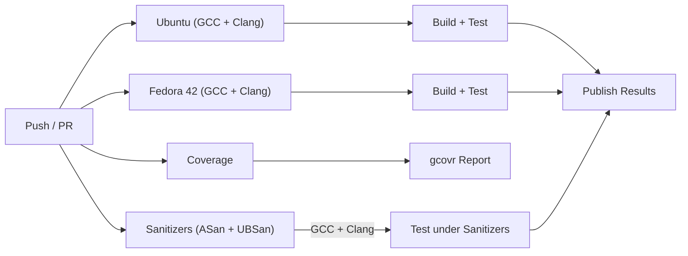

# Gateway Supported Platforms

The protocol gateways target Linux-class host systems where external protocol SDKs are available. Unlike the core `opensomeip` stack (which runs on bare-metal RTOS targets), gateways require POSIX networking and depend on userspace libraries.

## Platform Matrix

| Platform | Architecture | Compiler | CI Tested | Notes |
|----------|-------------|----------|-----------|-------|
| Ubuntu (latest) | x86_64 | GCC | :white_check_mark: | Primary CI platform |
| Ubuntu (latest) | x86_64 | Clang | :white_check_mark: | |
| Fedora 42 | x86_64 | GCC | :white_check_mark: | Container-based CI |
| Fedora 42 | x86_64 | Clang | :white_check_mark: | |
| macOS (latest) | arm64 (Apple Silicon) | AppleClang | | Local dev verified |

## CI Pipeline



| Job | Platform | Compilers | Purpose |
|-----|----------|-----------|---------|
| Build | Ubuntu | GCC, Clang | Build + test all gateway libraries and tests |
| Build (Fedora) | Fedora 42 | GCC, Clang | Fedora container build + test |
| Coverage | Ubuntu | GCC | Code coverage via gcovr |
| Sanitizers | Ubuntu | GCC, Clang | AddressSanitizer + UndefinedBehaviorSanitizer |

## Gateway SDK Dependencies

CI installs all required SDKs from system packages and builds every gateway
with the real libraries linked.

| Gateway | External SDK | CI Package (Ubuntu) | CI Package (Fedora) |
|---------|-------------|---------------------|---------------------|
| common | None | — | — |
| iceoryx2 | iceoryx2-cxx | Not packaged (inprocess sim) | Not packaged (inprocess sim) |
| MQTT | Paho MQTT C++ | `libpaho-mqttpp-dev` | `paho-mqtt-cpp-devel` |
| gRPC | gRPC + Protobuf | `libgrpc++-dev` | `grpc-devel` |
| ROS2 | rclcpp + std_msgs | Not packaged (callback mode) | Not packaged (callback mode) |
| D-Bus | libsystemd | `libsystemd-dev` | `systemd-devel` |
| Zenoh | zenohc | Not packaged | Not packaged |
| DDS | CycloneDDS | `cyclonedds-dev` | `cyclonedds-devel` |

!!! tip "Building a gateway locally"
    Gateway CMake options like `-DBUILD_GATEWAY_MQTT=ON` are defined in the
    [opensomeip-gateways](https://github.com/vtz/opensomeip-gateways) repository,
    not in the core opensomeip repo.

    ```bash
    # Example: MQTT gateway with Paho on Ubuntu
    sudo apt install libpaho-mqtt-dev libpaho-mqttpp-dev
    git clone https://github.com/vtz/opensomeip-gateways.git
    cd opensomeip-gateways
    cmake -B build -DBUILD_GATEWAY_MQTT=ON
    cmake --build build
    ctest --test-dir build --output-on-failure
    ```

## Compiler Requirements

| Compiler | Minimum Version | C++ Standard |
|----------|----------------|--------------|
| GCC | 9.0 | C++17 |
| Clang | 10.0 | C++17 |
| AppleClang | 12.0 | C++17 |
