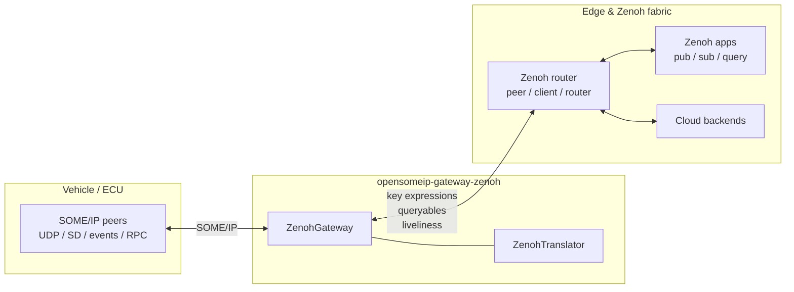

# SOME/IP ↔ Zenoh Gateway

The **SOME/IP ↔ Zenoh** gateway is a bidirectional bridge between SOME/IP (via [OpenSOME/IP](https://github.com/vtz/opensomeip)) and [Eclipse Zenoh](https://zenoh.io/). It targets **edge-to-cloud pub/sub** and location-transparent routing: in-vehicle ECUs keep speaking SOME/IP while edge and cloud components use Zenoh key expressions, queryables, and liveliness with a single logical namespace.

!!! info "Source repository"
    Implementation, tests, and examples live in [opensomeip-gateways](https://github.com/vtz/opensomeip-gateways) under `gateway-zenoh/`.

## Architecture



## Features

| Area | Behavior |
|------|----------|
| **Pub/sub** | SOME/IP notifications and event traffic map to Zenoh publications; subscribers receive keyed samples under the configured prefix. |
| **Request–response** | SOME/IP method-style traffic uses Zenoh **queryables** on dedicated RPC key paths so requests and replies stay correlated. |
| **SD proxy** | Optional bridge between SOME/IP service discovery and **Zenoh liveliness** tokens so availability can be observed on the Zenoh side. |
| **Session modes** | Zenoh session topology: **peer**, **client**, or **router** (serialized into Zenoh JSON5 config). |
| **Shared memory** | Optional Zenoh `transport.shared_memory` tuning (`enabled`, `threshold`) for high-throughput local paths. |
| **Payload encoding** | **Raw** (verbatim bytes), **JSON** metadata envelope, or **CBOR** map `{svc, method, type, payload}`. |
| **E2E validation** | Optional SOME/IP E2E check (`enable_e2e_validation`, `E2EConfig`) before forwarding when enabled. |
| **Liveliness tokens** | Keys under `liveliness/` advertise service instances; subscription pattern defaults to `{key_prefix}/liveliness/**`. |

## Key expression mapping

Identifiers are rendered with `MessageTranslator::format_service_id` (lowercase hex with `0x`, e.g. `0x1234`). The structured layout is **`{prefix}/{sid}/{iid}/…`** with a trailing **kind** segment that distinguishes event traffic, RPC, and liveliness.

| Pattern | Form | Meaning |
|---------|------|---------|
| Events / notifications | `{prefix}/{sid}/{iid}/{mid}/event` | `mid` is the SOME/IP method/event id; final segment **`event`** is the kind. |
| RPC (queryables) | `{prefix}/{sid}/{iid}/rpc/{mid}` | **`rpc`** is the kind segment; `mid` is the method id. |
| Liveliness (SD bridge) | `{prefix}/liveliness/{sid}/{iid}` | Service/instance availability for SD-aligned observers. |
| Instance wildcard | `{prefix}/{sid}/{iid}/**` | Subscription pattern for one service instance (`build_instance_pattern`). |

Custom **`key_expr`** values in YAML mappings can override the default hierarchy for a given service when you need stable application-specific keys.

!!! tip "Concrete examples"
    For `prefix = vehicle/ecu1/someip`, service `0x1234`, instance `0x0001`, method/event `0x8001`:

    - Event key: `vehicle/ecu1/someip/0x1234/0x0001/0x8001/event`
    - RPC key: `vehicle/ecu1/someip/0x1234/0x0001/rpc/0x0001`
    - Liveliness: `vehicle/ecu1/someip/liveliness/0x1234/0x0001`

## OpenSOME/IP APIs used

The gateway links against the core stack in the same way as other gateways: UDP framing, events, RPC, SD, serialization, E2E, and `Message` types.

| API | Header | Role in this gateway |
|-----|--------|----------------------|
| [Message](../api/index.md) | `someip/message.h` | Parse and build SOME/IP messages at the bridge boundary. |
| [UDP transport](../api/index.md#udp-transport) | `transport/udp_transport.h`, `transport/endpoint.h` | Optional SOME/IP UDP listener and reply routing. |
| [Events](../api/events.md) | `events/event_publisher.h`, `events/event_subscriber.h` | Publish/subscribe SOME/IP event groups when enabled. |
| [RPC](../api/rpc.md) | `rpc/rpc_client.h`, `rpc/rpc_server.h` | Method calls and server-side handling toward the SOME/IP network. |
| [Service discovery](../api/sd.md) | `sd/sd_client.h`, `sd/sd_server.h` | SD integration alongside liveliness bridging. |
| [E2E protection](../api/e2e.md) | `e2e/e2e_protection.h` | Optional end-to-end checks before forward. |
| [Serialization](../api/serialization.md) | `serialization/serializer.h` | Payload helpers where the stack serializes fields. |

## Configuration reference (YAML)

The example file `gateway-zenoh/examples/zenoh_config.yaml` shows the intended shape. Top-level keys are grouped under `gateway:`.

| Key | Description |
|-----|-------------|
| `gateway.name` | Logical gateway name (logging / ops). |
| `gateway.log_level` | Log verbosity hint for host tooling. |
| `gateway.zenoh.mode` | Session mode string: `peer`, `client`, or `router`. |
| `gateway.zenoh.connect` | List of Zenoh connect endpoints (e.g. `tcp/host:7447`). |
| `gateway.zenoh.listen` | Listen endpoints for peer/router setups. |
| `gateway.zenoh.key_prefix` | Base prefix for generated keys (see above). |
| `gateway.zenoh.shared_memory.enabled` | Enable Zenoh shared-memory transport. |
| `gateway.zenoh.shared_memory.threshold_bytes` | Minimum payload size for SHM path. |
| `gateway.zenoh.payload_encoding` | `raw`, `json`, or `cbor` (aligns with `ZenohPayloadEncoding`). |
| `gateway.someip.bind_address` / `bind_port` | UDP bind for SOME/IP leg. |
| `gateway.someip.remote_address` / `remote_port` | Default peer for replies. |
| `gateway.someip.rpc_client_id` | Client id used on the SOME/IP side. |
| `gateway.someip.enable_udp` | Enable UDP SOME/IP bridge. |
| `gateway.someip.enable_sd` | Enable SOME/IP SD integration. |
| `gateway.someip.enable_liveliness_bridge` | Bridge SOME/IP SD with Zenoh liveliness. |
| `gateway.service_mappings[]` | Per-service routes: nested `someip` (ids, methods, event groups), `zenoh` (`key_expr`, `encoding`), and `direction`. |

!!! note "Programmatic configuration"
    The C++ struct `ZenohConfig` mirrors these fields and exposes `to_json5()` for Zenoh-c `Config::from_str`. You can also set `zenoh_config_file` to load a base Zenoh config and merge explicit fields.

## C++ usage example

Minimal pattern: construct `ZenohConfig`, add `ServiceMapping` rows, and run the gateway lifecycle (`start` / `stop` / `on_someip_message` when integrated with a listener).

```cpp
#include "opensomeip/gateway/zenoh/zenoh_gateway.h"
#include "opensomeip/gateway/zenoh/zenoh_translator.h"

using opensomeip::gateway::GatewayDirection;
using opensomeip::gateway::ServiceMapping;
using opensomeip::gateway::zenoh::ZenohConfig;
using opensomeip::gateway::zenoh::ZenohGateway;
using opensomeip::gateway::zenoh::ZenohPayloadEncoding;
using opensomeip::gateway::zenoh::ZenohSessionMode;
using opensomeip::gateway::zenoh::ZenohTranslator;

ZenohConfig zc;
zc.mode = ZenohSessionMode::CLIENT;
zc.key_prefix = "vehicle/ecu1/someip";
zc.connect_endpoints.push_back("tcp/127.0.0.1:7447");
zc.payload_encoding = ZenohPayloadEncoding::CBOR;
zc.enable_liveliness_sd_bridge = true;
zc.enable_service_discovery = true;

ServiceMapping m;
m.someip_service_id = 0x6001;
m.someip_instance_id = 0x0001;
m.someip_method_ids.push_back(0x0001);
m.someip_event_group_ids.push_back(0x0001);
m.direction = GatewayDirection::BIDIRECTIONAL;

ZenohGateway gw("edge-bridge", std::move(zc));
gw.add_service_mapping(m);

const std::string rpc_sample = ZenohTranslator::build_rpc_key(
    gw.zenoh_config().key_prefix, m.someip_service_id, m.someip_instance_id, 0x0001);
// start(), on_someip_message(), stop() when wired to your runtime
```

Full sample: `gateway-zenoh/examples/zenoh_edge_bridge.cpp` (includes optional peer-session liveliness demo behind `ZENOH_EDGE_PEER_DEMO=1`).

## Build instructions

CMake option: **`BUILD_GATEWAY_ZENOH=ON`**. The target **zenohc** must be installed so `find_package(zenohc CONFIG)` succeeds (see [Zenoh installation](https://zenoh.io/docs/installation/)). The C++ API expects **`zenoh.hxx`** next to the zenoh-c install; set **`ZENOH_CPP_INCLUDE_DIR`** if headers are not found automatically.

=== "Configure and build"

    ```bash
    git clone https://github.com/vtz/opensomeip-gateways.git
    cd opensomeip-gateways
    cmake -S . -B build -DBUILD_GATEWAY_ZENOH=ON
    cmake --build build
    ```

=== "Example binary"

    With `BUILD_EXAMPLES=ON`, build the edge bridge example and run it from the build tree:

    ```bash
    cmake -S . -B build -DBUILD_GATEWAY_ZENOH=ON -DBUILD_EXAMPLES=ON
    cmake --build build
    ./build/gateway-zenoh/examples/zenoh_edge_bridge
    ```

!!! warning "zenoh.hxx dependency"
    If CMake reports `zenoh.hxx not found`, point **`ZENOH_CPP_INCLUDE_DIR`** at the directory that contains that header, or install a Zenoh distribution that ships the C++ wrapper alongside zenoh-c.

## Tracking

Feature discussion and roadmap: [GitHub issue #6 — Zenoh gateway](https://github.com/vtz/opensomeip-gateways/issues/6).
