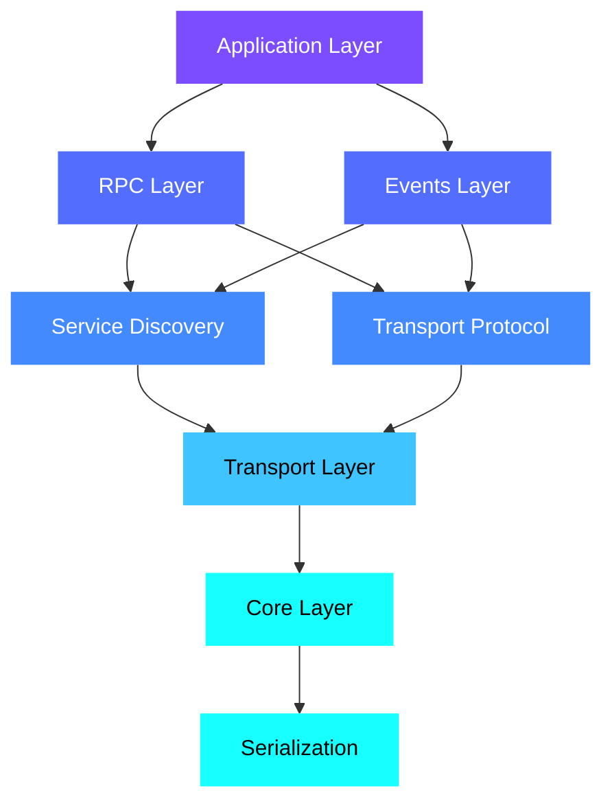

# Architecture & Design

OpenSOME/IP follows a modular, layered architecture with clear separation of concerns.
Each layer can be used independently or composed into a full-stack SOME/IP solution.

## Layered Architecture



## Layer Details

### Core (`someip-core`)

The foundation of the stack providing:

- **Message structures and types** -- SOME/IP header, message ID, request ID, return codes
- **Session management** -- Request correlation and session tracking
- **Error handling** -- Result types and return codes
- **E2E protection** -- CRC calculation, E2E header, profile registry

### Serialization (`someip-serialization`)

Data transformation layer:

- SOME/IP data type serialization and deserialization
- Big-endian byte order handling per specification
- Array and complex type support

### Transport (`someip-transport`)

Network communication layer:

- **UDP** -- Configurable blocking/non-blocking modes with socket buffer sizes
- **TCP** -- Connection management with message framing
- **ITransport interface** -- Clean abstraction for transport implementations
- **Platform Abstraction Layer (PAL)** -- Portable socket and threading APIs

### Service Discovery (`someip-sd`)

Dynamic service management:

- SOME/IP-SD message handling
- SD client and server with multicast support
- IPv4 options and service entry management
- Offer / Find / Subscribe protocol flows

### Transport Protocol (`someip-tp`)

Large message support:

- Segmentation of messages exceeding UDP MTU
- Thread-safe reassembly with configurable parameters
- TP manager for coordinating segmented transfers

### RPC (`someip-rpc`)

Remote procedure calls:

- Request/response client and server
- Method call routing and dispatching over transport

### Events (`someip-events`)

Publish/subscribe communication:

- Event publisher for producing notifications
- Event subscriber for consuming notifications
- Integration with Service Discovery for subscriptions

## Key Design Decisions

### Modern C++17

The codebase uses C++17 throughout with no legacy dependencies:

- `std::optional`, `std::variant`, `std::string_view`
- Structured bindings and `if constexpr`
- RAII for all resource management
- No raw owning pointers

### Safety-Oriented Patterns

While not safety-certified, the design follows patterns that support functional safety:

- **Input validation** on all external data
- **Const correctness** throughout
- **Thread safety** with documented guarantees
- **Error codes** instead of exceptions in core logic
- **Bounds checking** on all buffer operations

### Platform Abstraction

A clean PAL enables porting to new platforms:

| Platform | Transport | Threading | Status |
|----------|-----------|-----------|--------|
| POSIX / Linux | BSD sockets | pthreads | Stable |
| macOS | BSD sockets | pthreads | Stable |
| Zephyr RTOS | Zephyr sockets | Zephyr threads | Stable |
| FreeRTOS | lwIP | FreeRTOS tasks | Stable |
| Eclipse ThreadX | lwIP | ThreadX threads | Stable |

## Project Structure

```text
opensomeip/
├── include/           # Public headers (the API surface)
│   ├── someip/        # Core protocol types
│   ├── serialization/ # Serializer API
│   ├── transport/     # Transport abstraction
│   ├── sd/            # Service Discovery API
│   ├── tp/            # Transport Protocol API
│   ├── rpc/           # RPC client/server API
│   ├── events/        # Event pub/sub API
│   ├── e2e/           # E2E protection API
│   └── common/        # Shared utilities
├── src/               # Implementation
├── tests/             # C++ unit tests + Python tests
├── examples/          # Working code samples
├── docs/              # Documentation
├── scripts/           # Build & test utilities
└── open-someip-spec/  # SOME/IP specification (submodule)
```

## Standards Compliance

Protocol coverage is tracked against the [Open SOME/IP Specification](https://github.com/some-ip-com/open-someip-spec):

- **585 / 649** specification requirements traced
- Traceability maintained via Sphinx-Needs annotations in code
- Coverage reports generated on every CI run

See the [Requirements Documentation](../requirements/) and
[Traceability Matrix](../traceability/matrix.html) for details.
