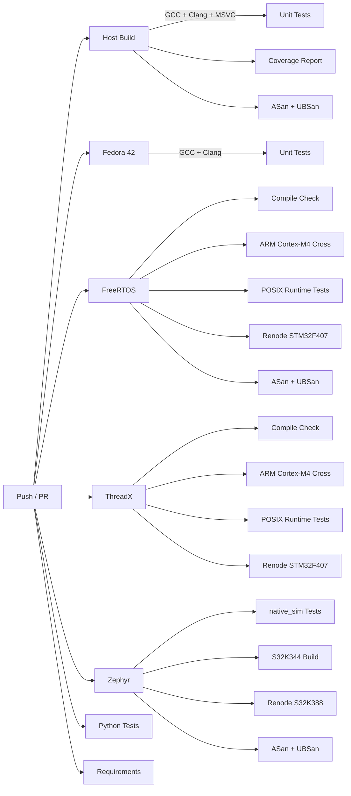

# Supported Platforms & Architectures

OpenSOME/IP is designed for portability across host operating systems, embedded RTOS platforms, and CPU architectures. This page documents the full platform matrix, CI validation status, and cross-compilation support.

## Platform Matrix

### Host Operating Systems

| Platform | Architecture | Compiler | CI Tested | Notes |
|----------|-------------|----------|-----------|-------|
| Ubuntu (latest) | x86_64 | GCC | :white_check_mark: | Primary development platform |
| Ubuntu (latest) | x86_64 | Clang | :white_check_mark: | |
| Fedora 42 | x86_64 | GCC | :white_check_mark: | Container-based CI |
| Fedora 42 | x86_64 | Clang | :white_check_mark: | Container-based CI |
| Windows (latest) | x86_64 | MSVC (cl) | :white_check_mark: | |
| macOS (latest) | arm64 (Apple Silicon) | AppleClang | :white_check_mark: | Verified locally |

### Embedded / RTOS Platforms

| Platform | CPU Target | Toolchain | CI Tested | Runtime Tests | Docs |
|----------|-----------|-----------|-----------|---------------|------|
| Zephyr RTOS | native_sim (x86_64) | Host GCC | :white_check_mark: | :white_check_mark: | [Zephyr Port](ZEPHYR_PORT.md) |
| Zephyr RTOS | NXP S32K344 (Cortex-M7) | Zephyr SDK ARM | :white_check_mark: | Build only | [Zephyr Port](ZEPHYR_PORT.md) |
| Zephyr RTOS | NXP S32K388 (Cortex-M7) | Zephyr SDK ARM | :white_check_mark: | Renode simulation | [Zephyr Port](ZEPHYR_PORT.md) |
| FreeRTOS | Host (POSIX port) | Host GCC | :white_check_mark: | :white_check_mark: | [FreeRTOS Port](FREERTOS_PORT.md) |
| FreeRTOS | ARM Cortex-M4F | arm-none-eabi-gcc | :white_check_mark: | Renode STM32F407 | [FreeRTOS Port](FREERTOS_PORT.md) |
| Eclipse ThreadX | Host (Linux port) | Host GCC | :white_check_mark: | :white_check_mark: | [ThreadX Port](THREADX_PORT.md) |
| Eclipse ThreadX | ARM Cortex-M4 | arm-none-eabi-gcc | :white_check_mark: | Renode STM32F407 | [ThreadX Port](THREADX_PORT.md) |

### CPU Architecture Summary

| Architecture | Endianness | Word Size | Tested Via |
|-------------|-----------|-----------|------------|
| x86_64 | Little | 64-bit | Linux, macOS, Windows native builds |
| ARM Cortex-M4/M4F | Little | 32-bit | FreeRTOS + ThreadX cross-compilation, Renode simulation |
| ARM Cortex-M7 | Little | 32-bit | Zephyr cross-compilation, Renode simulation |
| AArch64 (Apple Silicon) | Little | 64-bit | macOS native builds |

!!! note "Big-Endian Support"
    SOME/IP wire format uses network byte order (big-endian). The serialization layer handles byte-swapping transparently on all little-endian platforms listed above. The code is written to be endian-neutral but has not been CI-tested on big-endian hosts.

## CI Pipeline Overview

The CI pipeline runs on every push to `main` and on all pull requests:



### CI Jobs Summary

| Job | Compiler(s) | Sanitizers | Coverage | Test Results |
|-----|-------------|------------|----------|--------------|
| Host Build | GCC, Clang, MSVC | :white_check_mark: ASan + UBSan | :white_check_mark: gcovr | JUnit XML + CTRF |
| Fedora 42 | GCC, Clang | — | — | JUnit XML |
| FreeRTOS | GCC (host + cross) | :white_check_mark: | :white_check_mark: | JUnit XML |
| ThreadX | GCC (host + cross) | :white_check_mark: | — | JUnit XML |
| Zephyr | GCC (host + Zephyr SDK) | :white_check_mark: | — | JUnit XML |
| Python | Python 3.x | — | pytest-cov | — |
| Coverity | — | Static analysis | — | — |

## Cross-Compilation

See the [Cross-Compilation Guide](cross-compilation.md) for detailed instructions on building for embedded targets using CMake presets.

### Quick Reference

```bash
# ARM Cortex-M4 with FreeRTOS
cmake --preset freertos-cortexm4
cmake --build --preset freertos-cortexm4

# Zephyr native_sim (for testing without hardware)
west build -b native_sim zephyr/tests/test_core

# Zephyr on NXP S32K344
west build -b mr_canhubk3 zephyr/samples/hello_s32k
```

## Compiler Requirements

| Compiler | Minimum Version | C++ Standard |
|----------|----------------|--------------|
| GCC | 9.0 | C++17 |
| Clang | 10.0 | C++17 |
| AppleClang | 12.0 | C++17 |
| MSVC | 19.28 (VS 2019 16.8) | C++17 |
| arm-none-eabi-gcc | 10.0 | C++17 |

## Adding a New Platform

To add support for a new RTOS or CPU architecture:

1. Implement the Platform Abstraction Layer (PAL) in `include/platform/` and `src/platform/`
2. Create a CMake toolchain file in `cmake/toolchains/`
3. Add a CMake preset in `CMakePresets.json`
4. Add a CI workflow in `.github/workflows/`
5. Document the port in `docs/`
6. Add an entry to this table
